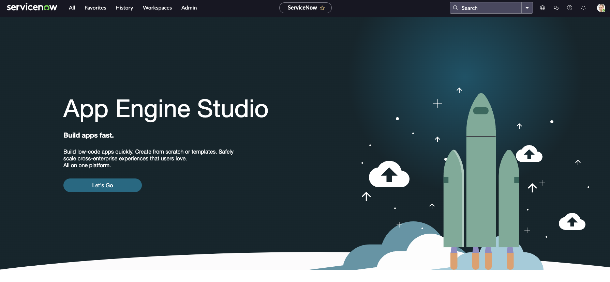
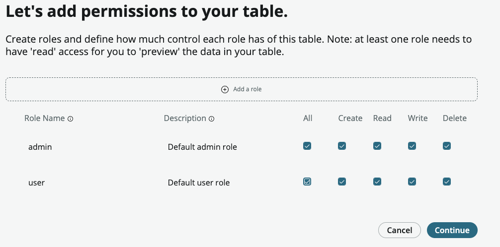
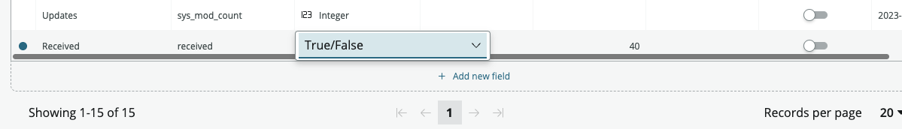
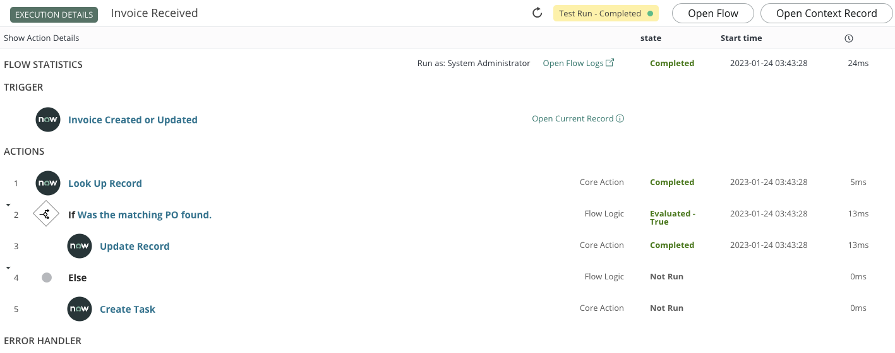
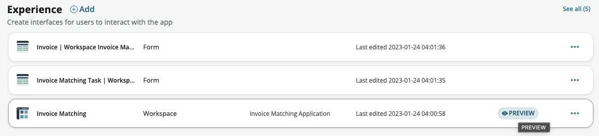
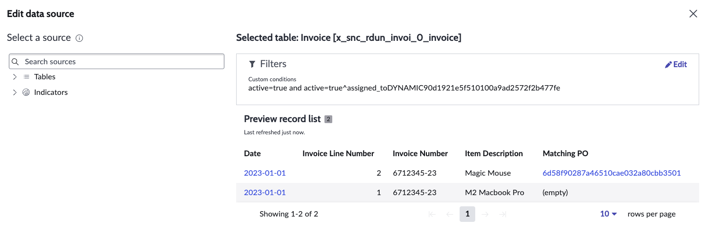
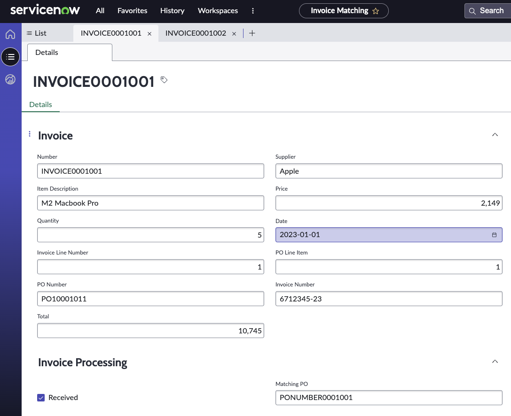

# Invoice and Purchase Order matching Example LowCode Application

## Overview

In this exercise we are going to build a small app that has the
following

-   2 spreadsheets of data that we need to match.

-   1 workflow that we are going to use to compare the data

-   A workspace with a dashboard.

We will be building using ServiceNow Tokyo Release with Patch 3 Installed.

# Getting Started 
## Requesting an instance to build on.

For the build of this application, you will need a system with the
following 

-   Tokyo Release with Patch 3 or later.

-   App Engine Studio installed.

-   Optional -- Integration Hub spokes

-   Optional -- Document Intelligence

## Developer instances

You can build this example using the developer instances at
<https://developer.servicenow.com>. You will need to register for a ServiceNow ID if you don't have one already. The developer site has lots of useful information about how to develop using the ServiceNow platform.

- Request an instance it will come with App Engine Studio already installed, so you can get started quickly.

> NOTE: If you don't use your instane it will go to sleep and eventually be returned to the pool, so if you want to retain any of the work you do, you'll need to create a backup that you can restore later.

- Once your system is ready login, you will see a screen like this, click "Let's Go"

# Invoice checking App data.

The App we will be building has 2 tables that we will import from some
spreadsheets. The spreadsheets are available with this Word Document.
Feel free to add more data into the spreadsheets.

## PO Spreadsheet

The PO spreadsheet has some basic data on, if you want to add more to
the sheet, feel free. If you change any of the fields that are used in
this tutorial, you may have to adjust the workflows and workspaces.

## Invoice spreadsheet

The Invoice spreadsheet has the other basic data that we need to make
this work. The key elements that we need on this is the PO Information
that we are going to use to match with our workflow.

# Creating the Application

-   Log into to your system (reset the admin password if needed).

-   Open the menu and type "App Engine" in the search. Make App Engine
    Studio a favourite.

-   Now open App Engine Studio so we can start building our low code
    application.

-   When App Engine studio starts, click "Create App"

-   Now fill in some information about your application. As several
    people will be creating the same application, put your initials or
    customer name in the name to make it unique. You can change the name
    later.

-   You can add a logo here as well if you please, but for now click
    "Continue".

-   The next screen will ask you to create some basic application roles,
    you get add more if you wish and you can add more later. For now,
    just click continue

-   Assuming all has gone well, you will now be presented with the
    following screen to say your app is ready to start building. Click
    "Go to app dashboard"

# Loading the data into your application

We now have our application, let's start by uploading out data.

-   Click "(+) Add" next to the Data section.

> 

-   Click "Create a table", then click "Begin" after quickly reading the
    instructions on the page

-   You will now be asked how you're going to import the data, we are
    going to be importing a spreadsheet, so go ahead and click "Upload a
    spreadsheet" and then "Continue"

-   We are going to upload the Purchase Orders first, so drop the
    PO.xlsx spreadsheet into the window. The system will quickly read
    the sheet and present this to you.

> 

**NOTE**: Make sure you select "Import spreadsheet data" otherwise
you'll get the table structure but no data.

-   Now that the spreadsheet has been analysed, you will be presented
    with a screen showing the fields, the data type the import thinks is
    correct. You can scroll this list up and down.

-   We need to do a little work on the date being imported as a couple
    of fields need to be slightly different, for example "Price" needs
    to be a floating-point number, e.g. a number with a decimal dot in
    as we need pounds and pence. Simply click the "Type" and change it
    from "Integer" to "Floating Point".

> The table below lists the fields and the data types we want them to
> be. This is just a list of the differences.
>  |Field Name |Original Data Type | Required Data Type
>  |------------| ---------------------- | -----------------------|
>  |Price | Integer | Floating Point Number |
>  |Total | String | Floating Point Number |

**NOTE**: Some fields such as description may need to be bigger, but we
can either do that here or later if needed. If the spreadsheet contains
text that is very long, the field will suggest a size that fits.

-   Click "Continue" to move to the next stage which is to define the
    table name

-   Fill in the table label "Purchase Order". The table name will get
    created for you.

-   Click "Auto number" and adjust the prefix to be something sensible.
    If the prefix is already in use, it will show as red when you click
    continue, so you may have to pick a different one.

-   Click continue to define who has access to the data. To keep it
    simple, just give everyone the ability to add, read, write, and
    delete.

-   Click "Continue" and the data will get imported into your
    application.

-   When that has completed, click "Done".

Congratulations, you have loaded a spreadsheet of data into your
application.

### Load the Invoice spreadsheet into your application.

Following the instructions in the previous section, load the
Invoice.xlsx spreadsheet into your application.

-   When you get the section that requires you to specify the fields and
    data types, you will need to make the same changes as the Purchase
    order spreadsheet, these were.

>  | Field Name | Original Data Type | Required Data Type |
>  |-----------------------|-----------------------|-----------------------|
>  |Price | Integer | Floating Point Number |
>  |Total | String | Floating Point Number |  

-   Call the table "Invoice"

-   Add auto numbering like the previous table, with a suitable auto
    number prefix.

-   As with the previous table, give both roles access to the data to
    keep it simple.

> 

# Adding fields to the Invoice Table.

Now that we have imported the basic data and structure, we want to add
some additional fields to the Invoice tables for our workflow.

## Fields to add to the Invoice Table.

We need to add a couple of fields to help make everything work. The two
fields we need to add are

1.  A true / false field that will be used to trigger our workflow.

2.  A reference field back to the Purchase Order that we will fill in
    with a workflow when the Invoice and PO match.

To add fields to the table, we need to do the following

-   Open the Invoice table in App Engine Studio.

-   Click "+ Add new field"

-   Enter "Received" into the Column Label field.

-   The field needs to be of type "True / False", which is a checkbox
    for the user.

-   Make the default value for the field "True".

-   Now click "Save" at the top of the window to add the field. You
    don't have to hit save each time, but just remember to do when you
    have finished.

-   Now add a new field, this time called "Matching PO" with a type
    called "Reference". When picking "Reference" you will be asked which
    table you want to have as the reference.

-   Make sure the Number field at the top of the table is set as the
    display field.

# Updating the Purchase Order table.

We need to update the Purchase order table to have a default display
field like the invoice table.

-   Open the Purchase order table.

-   Select "Display" next to the number field.

-   Click "Save" to save the changes.

# Adding a workflow to the application

Within the table view, you will have noticed a couple of extra sections
at the top of the window.

These are Forms and Flows. Forms takes you to the screen to adjust the
form layout and flows takes you to flow designer where we will build a
workflow for this table.

-   With the Invoice table open, click the Flows heading. You should now
    see a new window asking you to create a new flow. If you have a flow
    already created for this table, it will show here as well.

-   Click "(+) Add new flow"

-   Now give the flow a name and a description. Make the name something
    that explains what it does. Then click "Continue"

-   Next, we will be asked when the flow will run, in this case, we want
    to run when a record is created or updated. Then click "Continue"

-   Once the workflow has been created, you will now need to add some
    logic. It takes a few moments to create the workflow. In the latest
    version of flow designer, you will be presented with the flow chart
    view by default.

-   Click on the three dots to the right of the "Created or Updated"
    tile that has been added to the view and select "view"

-   This brings up the properties of this tile. We need to change when
    the flow starts so that it only starts when the "Received" field we
    just added changes from false to true, e.g., it's ticked.

-   Change the "Run Trigger" to "For every update"

> 

-   We now need to add a condition, so click the "Add Condition" button.

-   Add the following to the conditions popup and click "Done"

-   If all goes well, you should have this as your property. You can
    keep the property window open if you want, or close, but we will be
    adding more flow tiles.

-   Now we need to add a new node. This node is going to search for the
    matching Purchase Order, so click "(+) Add a node" and pick "Action"

-   The action we are going to add is the "Lookup Record" action.

![(./media/media/image31.png)

-   In the properties of this action, we are going to look up the
    Purchase order table and try to find the matching Purchase order
    line. First step is to add the table. To help you find the table put
    "x_snc\_" and then start typing your app name, this will give you
    the tables in your application, so in my case my application started
    "rdun". Then select the Purchase order" table.

-   Now we are going to add the search criteria / conditions to find the
    record we want. In this case the invoice line has the PO number and
    PO Line to help us match. Click the "Add Conditions" button. You
    will be presented with a popup like before.

-   Pick "PO Number" as the field, then click the search button to bring
    up the fields to search for.

-   Now find the PO Number field in the invoice record.

-   Now click "AND" as we want to search for the PO Number AND the PO
    Line Number

-   Repeat the above steps so that you have selected the PO Line Number
    on the Purchase order table and the PO Line number on the Invoice
    table. It should look like this.

**NOTE**: When selecting the record field, make sure you click the \>
symbol to bring up the field list, otherwise it select the SysID of the
record which won't match.

-   Click "Done" to return back to the properties.

-   In the properties of this action, also pick the "Don't fail on
    error" checkbox, which means if you don't find a record, don't stop
    the process, but proceed to the next step as we want to do things
    since the PO hasn't matched.

-   Next, we are going to add some logic, so click "(+) Add a node"
    again, but this time we are going to add "Flow Logic"

-   In the flow logic we are going to pick an "If" statement.

-   In the properties section, we now need to add the logic. Click the
    Add Conditions button

-   Click the search button on the condition popup.

-   We want to check to see if the "Look Up Record" action that we just
    added has worked, e.g., it found a matching PO line. Pick the Status
    choice field

-   You will be given two choices, in this case we are interested in the
    success, e.g., the record has been found.

-   Now click "Done".

-   Add a label to the condition which explains what it is doing, this
    helps later when trying to understand what the workflow is doing.

-   Click "Done" at the bottom of the properties window. You will also
    now see a "true" and "false" section. The next step is to add the
    action to the "true" section to update the invoice with a reference
    back to the PO.

-   Click the (+) under the true

-   Add an action like before

-   This time we are going to update a record.

-   In the properties section, we want to select the Invoice Record that
    started the workflow. This time don't click the \> next to the
    invoice record as we want to update the whole record.

-   We want to add a field to update. You can add multiple fields to
    update if you wish, but for this use case we only want to update
    one. Click "Add Fields". You will see a popup like before.

-   Add the "Matching PO" field that we created earlier.

-   Click the search button and then select the record we looked up in
    the previous action. We want the whole record this time.

-   Then click "Done"

-   Now click "Done" on the properties to make sure it is saved. I would
    also click "Save" at the top of the flow at this point.

The flow we have just created will attempt to find the matching PO, we
haven't at this stage done anything with the value of the Invoice or the
PO. If there isn't a matching PO the process will just complete and not
update the Invoice with the matching PO.

We could then create a view that shows all the invoices that don't have
a matching PO, but what would be great is that if we created a task
table for someone to be given the job of matching the Invoices to the
PO's

In the next section we are going to extend the task table for our app to
allow it to create tasks for team members to work on, we will come back
to our workflow to add the additional steps later.

# Creating a Task Table for work in our App.

-   Navigate back to the main app window and click the (+) Add button
    next to the Data section, like we did when uploading the
    spreadsheet.

-   Click "Create Table" like we did before.

-   When you get to the choice of how we are going to create our table,
    you will need to select "Create from existing table". Click
    Continue.

-   Type "Task" in the table and select the task table, there are a few
    different ones, select the right one and click "Continue"

-   Now we need to give our extended table a name and auto number it. So
    give your table a name, select the "Auto number" checkbox and adjust
    the numbering scheme

-   Click "Continue" and make sure everyone has full rights to the
    table. Remember in real life we would be a little stricter about the
    rights for the different roles. And click "Continue".

-   Open the table and add a new field. We want a reference field back
    to the Invoice we need someone to work on.

The table is now created, it inherits all the functionality such as
approvals etc from the task table, which makes life nice and easy for
us.

# Updating the workflow to add tasks for people.

In the workflow we started, we needed to add a step to assign work to
people when a matching PO is not found.

-   Navigate back to the workflow, it should still be open on the
    Invoice table tab, if not re-open the invoice table and select the
    "Flows" section again and open the workflow.

-   Click the (+) below the "false" leg of the If statement. We are
    going to add an action, but this time we are going to Create a task.

**NOTE**: this action is used with the task table or a table that is
extended from task, it does a lot of the pre-populating of the mandatory
fields.

-   In the properties of the new action, select our new application task
    table.

-   Click "Add Fields" and then select the new Invoice field you just
    added to the task table

-   Add a description that explains what the problem is for the person
    who will be assigned the task.

-   Add the State field and set it to pending.

-   Click "Done" and then on the main workflow, click "Done".

-   Don't forget to save your flow.

## Testing our new workflow.

Before we make the workflow active, we want to test it.

-   This can be done by clicking "Test" at the top of the flow.

-   A pop up will appear, select one of the examples we loaded into the
    system and then click "Run Test"

-   When the test is complete, the popup will change and there is a link
    to go look at the how well the flow ran.

-   Clicking the link will take you to a screen that shows how well (or
    not) the process ran.

In this case the workflow completed and updated the record to say it
found the matching PO.

Now that has completed and seems to work fine, we can make it active.

-   Close the executions tab and go back to the workflow tab you have
    open.

-   Close the "Test Flow" popup by either clicking "Cancel" or the cross
    at the top.

-   Now click "Activate" and you will be asked are you sure, you are, so
    click "Activate" on the pop up.

# Building a workspace for our App.

Now that we have the basic data in place and a workflow, we now need a
User Interface / Workspace to allow people to work on the Invoices and
PO's. For this we are going to create an experience.

-   Navigate back to the main application window and select (+) Add next
    to the experience section.

-   Select Workspace

-   Click "Begin", you will be asked a few questions before starting the
    build process.

-   Fill in a name, this doesn't have to be the application name and a
    description. The URL for the application is created automatically
    based on the name. Then click "Continue".

-   You will now be asked about the tables you want to appear on the
    left menu. By default, invoice will be the first one, but you can
    change this. You don't have to have all the tables, but for now just
    go with the default. We can always rebuild / modify this later.

-   Click "Continue" and the workspace will be created. This may take a
    couple of moments to complete.

-   When completed you will see the following, click "Done" for now.

# Modifying the workspace

Before we go ahead and modify the workspace, let's look at what has been
generated for us.

-   Click "Preview" next to the Workspace that has been created.

The following workspace will be displayed. On this landing page /
dashboard you will see several widgets that are showing data.

These don't make a lot of sense for the data in our application, so we
are going to adjust these widgets first. There are two ways we can do
this; both will accomplish the same task, since we have the workspace
open, we can do it from here.

-   With the Workspace dashboard open, click the "Edit" button at the
    top. The screen will change into the edit mode, which allows us to
    adjust the size of widgets, add new ones and adjust the ones already
    there.

-   First, we want to change the "My Tasks" widget. Click the widget and
    then click the 3 dots on the top and select "Configure"

The configuration options will appear on the right of the screen, this
may take a few moments to load. We are going to change the label and the
data source

-   In the Data source, select the 3 dots and click edit. This will
    allow us to change the data source.

The "Edit data source" window will appear, it will look something like
this.

We are going to change the data source to only show the number of
records that aren't matched.

-   Click "Edit" next to the filter section. This will show two filter
    criteria, if these are blank, then fill in the top one with the
    following criteria and remove the other. You should end up with
    this.

-   Click "Run" to verify the data that is returned looks correct.

-   When you are happy with the data, click "Apply" to take you back to
    the previous screen.

-   To change the label, expand the "Header and border" section to show
    the Chart Label.

-   Change the label to "Unmatched Invoices". Then click on the main
    window to apply.

-   You can change this to a visual such as a dial if that works better
    by selecting the "Visualization type" to be a dial for instance.
    This will change it to look this this

Next, we want to change the unassigned tasks to be only the tasks in our
application. So this is the same as the previous widget.

-   Open the properties and edit the data source.

-   Now change the table to be our task table, you can find it by
    starting to type the application prefix, in my case this was
    "x_snc_rdu". Select the task table we created.

-   We need to add some filters. We want to show all tasks that are not
    assigned to a person **AND** a group. When we run this filter we
    should have no tasks showing at the moment.

-   Now apply this filter and return to the previous screen.

-   The label doesn't need to be changed, but you can if you want.

The last widget, we need to change to show the tasks you are assigned to
or are assigned to a group you belong to.

-   Open the data window, change the task table, and set the filter to
    be any task that is assigned to you OR assigned to a group you
    belong to. You will notice that the suggested table will have the
    ones you have used recently to make it easier.

NOTE: The Dynamic filter will change to the user who is logged in, so
will work for anyone using the application, so you don't need to
hardcode the user or group.

-   Change the label of the widget to show "My Tasks". This is what it
    should look like

Next step is to change the "My Work" widget to show the tasks that are
assigned to you. As this is a list, it has some different configuration
options.

-   Click the widget and select the task table for our application
    first.

-   Now check the filters by selecting "Edit Filter" and a popup will
    appear.

-   We need to add an additional OR filter for the assignment group you
    belong to.

-   Click "Apply" to return back to the previous screen.

-   Click "Save" and then "Exit editing mode" to save the changes.

The dashboard is now fully functional, the widgets will drill down into
the records that make up them and the list view will drill into the
individual records.

-   Click the list section on the left will show the various views which
    can be modified in App Engine Studio.

Next, we will modify the form views to make it easier to work with the
data.

# Modifying the form layouts.

Now that we have created a workspace, we need to tidy up the default
form layouts. This is done back in App engine Studio.

-   Navigate back to the application.

-   Open the Invoice table first and click "Forms: at the top of the
    page.

-   First, we need to select the view, which needs to be the workspace
    we created. A common mistake is to forget to change this and wonder
    why the form didn't update.

-   We are going to add a section at the bottom of the view for the
    additional fields we created. Click the (+) symbol at the bottom of
    the first section. As you hover over the (+) it will change to say
    "(Add section)"

-   A new section will be added to the page, the default is a single
    colum, this can be changed by selecting "Two Columns" on the right.

-   Change the label to be "Invoice Processing".

**NOTE**: if you don't want a new section, just click the "Merge with
section above" button and it will just get attached to the section about
and you don't need to worry about the label.

-   Now drag in the "Received" and "Matching PO" fields into the new
    section. It should look like this

-   Reopen the workspace (or refresh if you have it open) and open one
    of the Invoice records.

# Testing the workflow from the workspace.

Now that we have created a workspace and defined the dashboards, and we
now need to test our workflow starts at the correct time.

We have one record that doesn't have the matching PO defined, so let's
walk through updating that record.

-   Open the workspace, either navigate to the list view and select all
    invoices or click on the Unmatched Invoices widget on the home
    screen.

-   Open the Invoice that hasn't been matched to the Purchase order so
    far.

-   Tick the "Received" box, which is the trigger for the workflow and
    click "Save". Shortly after this has happened, the workflow should
    start and then the display will change to this.

